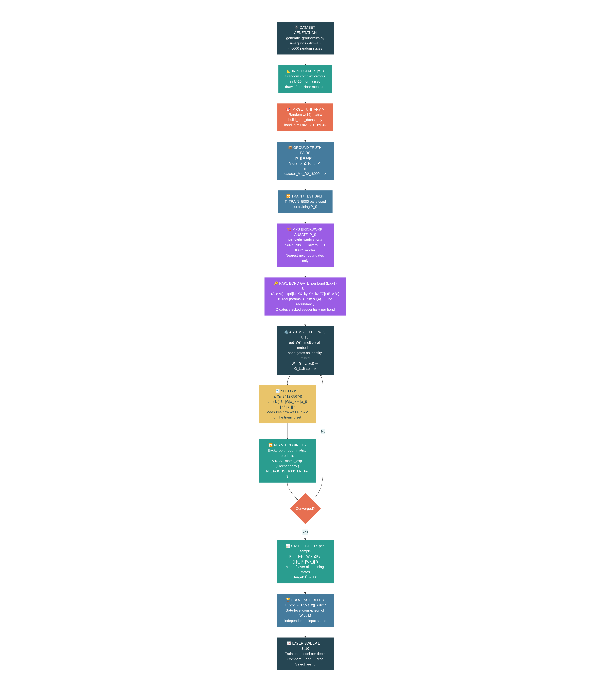

# TN Networks Learning Compilation

This repository implements the TN/NFL workflow for learning a target unitary \(M\) with an MPS brickwork ansatz, then visualizing the learned circuit structure.



## Requirements

Use the project environment from `pyproject.toml`:

- Python `>=3.14`
- Core packages: `numpy`, `matplotlib`, `torch`, `qiskit`, `pylatexenc`
- Also included in the project dependencies: `autoray`, `cotengra`, `networkx`, `quimb`

Install dependencies:

```bash
uv sync
```

Or with pip:

```bash
pip install numpy matplotlib torch qiskit pylatexenc autoray cotengra networkx quimb
```

## Workflow (from data to visualization)

### 1. Build the pool/dataset states

Script:

```bash
python build_pool_dataset_new.py
```

What it does:
- Generates a Haar-random local unitary pool.
- Samples training input states \(|x_j\rangle\) from that pool.
- Saves pool data to `output/pool_mps1_D2.npz`.

### 2. Build ground-truth target unitary \(M\) and labels

Scripts:

```bash
 python generate_M_and_dataset.py
```

and (alternative variant):

```bash
python generate_groundtruth.py (trial)
```

What they do:
- Generate a Haar-random global target unitary \(M \in U(2^n)\).
- Apply \(M\) to sampled inputs to create labels \(|\phi_j\rangle = M|x_j\rangle\).
- Save dataset artifacts (including `X`, `Phi`, `M`, `indices`) to:
  `output/dataset_M4_D2_t6000.npz`.

Recommended after Step 1: use `generate_groundtruth.py` (it points to `output/pool_mps1_D2.npz` by default).
If using `generate_M_and_dataset.py`, update `POOL_PATH` in its `USER PARAMETERS` block to your generated pool file.

### 3. Train the ansatz with the generated dataset

Script:

```bash
python train_ps_brickwork_kak1.py
```

What it does:
- Loads `output/dataset_M4_D2_t6000.npz`.
- Trains the MPS brickwork KAK1/SU(4)-based ansatz across layer depths.
- Uses dataset pairs \((|x_j\rangle, |\phi_j\rangle)\) with
  \(|\phi_j\rangle = M|x_j\rangle\), and model outputs
  \(|\Psi_j\rangle = P_S|x_j\rangle\).
- Optimizes the NFL training loss:
  \[
  \mathcal{L}=\frac{1}{t}\sum_{j=1}^{t}\frac{\|P_S|x_j\rangle-|\phi_j\rangle\|^2}{\|x_j\|^2}.
  \]
- Tracks **state fidelity** per sample:
  \[
  F_j=\frac{|\langle\phi_j|P_S|x_j\rangle|^2}{\|\phi_j\|^2\cdot\|P_S|x_j\rangle\|^2},
  \]
  and reports mean fidelity \(\bar{F}=\frac{1}{t}\sum_j F_j\) during training.
- Reports **process fidelity** after training:
  \[
  F_{\mathrm{proc}}=\frac{|\mathrm{Tr}(M^\dagger W)|^2}{\mathrm{dim}^2},
  \]
  where \(W\) is the unitary implemented by the trained ansatz \(P_S\).
- Saves training outputs to:
  - `output/training_loss_fidelity_mps_kak1_layers_3_10.png`
  - `output/fidelity_summary_mps_kak1_layers_3_10.png`
  - `output/training_results_mps_kak1_layers_3_10.npz`

### 4. Visualize the circuit architecture

Script:

```bash
python visualize_mpsbrick_SU4_qiskit.py
```

What it does:
- Builds and draws the MPS brickwork SU(4) circuit in Qiskit.
- Saves figures to:
  - `output/architecture/mps/ps_brickwork_SU4_qiskit_l1_D3.png`
  - `output/architecture/mps/ps_brickwork_SU4_qiskit_layerwise_l1_D3.png`

## Notes

- Default hyperparameters are defined inside each script (see each `USER PARAMETERS` / `HYPERPARAMETERS` block).
- Ensure Step 1 is run before Step 2, and Step 2 before Step 3.

## FIXES

This branch fixes the implementation errors found during review:

### 1. Training applied the adjoint unitary

Dataset labels are built with ket action:

```python
Phi = (M @ X.T).T
```

For row-stored state vectors, the model must therefore apply a learned unitary
as:

```python
X @ W.T
```

The trainer previously used `X @ W.T.conj()`, which applies \(W^\dagger\).
That meant training optimized the wrong unitary orientation and the reported
process fidelity compared the wrong matrix against \(M\).

Fixed in `train_ps_brickwork_kak1.py`:
- `MPSBrickworkPS.forward()` now uses `X @ W.T`.
- `MPSBrickworkPSSU4.forward()` now uses `X @ W.T`.
- Final training loss and per-sample fidelities are recomputed after the
  optimizer update, so reported metrics match the exported final unitary.

### 2. Default training required CUDA

`train_ps_brickwork_kak1.py` previously defaulted to:

```python
DEVICE = "cuda"
```

On machines without CUDA, the script failed immediately with
`AssertionError: CUDA not available`.

Fixed by changing the default to:

```python
DEVICE = "auto"
```

The trainer now chooses CUDA when available, then Apple MPS, then CPU.

### 3. Aggregate dataset generation used the legacy unnormalised sampler

`M_dataset_agg.py` imported `sample_from_pool` from the older `build_pool.py`.
That path can emit input states with variable norms. The default aggregate
dataset used by training therefore differed from the normalized workflow
documented in this README.

Fixed in `M_dataset_agg.py`:
- It now imports `load_pool` and `sample_from_pool` from
  `build_pool_dataset_new.py`.
- It explicitly normalizes `X` before building labels.
- Future aggregate datasets satisfy \(\|x_j\| = 1\) and
  \(\phi_j = Mx_j\).

The trainer also normalizes loaded `X` and `Phi` together before training, so
older checked-in datasets with variable norms remain usable while preserving
`Phi = M @ X`.

### 4. MPO tensors were incorrectly converted into local physical gates

`trial/mpo_circuit_contracted.py` previously tried to convert adjacent MPO
tensors into two-qubit gates by summing dangling virtual bonds and projecting
the result to the nearest unitary. That operation is not equivalent to the MPO
operator. Even when full-rank MPO reconstruction was exact, the generated
local-gate circuit did not implement the target unitary.

Fixed by turning `trial/mpo_circuit_contracted.py` into an MPO reconstruction
diagnostic:
- It decomposes a dense unitary into MPO tensors with sequential SVD.
- It contracts MPO tensors back to a dense operator.
- It reports tensor shapes, retained bond dimensions, process fidelity,
  Frobenius reconstruction error, relative Frobenius error, and unitarity
  residual.
- It no longer claims to synthesize an equivalent local-gate circuit.

### 5. Haar unitary helper destroyed unitarity and tensorized the wrong shape

`trial/mpo_circuit.py` generated a valid Haar unitary, then divided it by its
Frobenius norm. For a \(16 \times 16\) unitary, this scales the matrix by
\(1/4\), so \(U^\dagger U \ne I\).

The same script also reshaped a 4-qubit operator with 256 entries into
`(2, 2, 2, 2)`, which only has 16 entries and cannot represent an
\(n\)-qubit operator.

Fixed in `trial/mpo_circuit.py`:
- Haar matrices are no longer Frobenius-normalized.
- `verify_unitary()` validates \(U^\dagger U = I\).
- Dense operators tensorize to shape `[2] * (2 * n_qubits)`.
- Script execution is guarded by `main()`, so importing the module has no
  plotting or printing side effects.

### 6. MPS visualization did not prepare the displayed state

`visualize_circuits_M.py` previously treated sampled pool matrices as
nearest-neighbor physical gates and looped over only `n_qubits - 1` of the
sampled unitaries. That circuit did not actually prepare the saved MPS state
shown in the labels.

Fixed in `visualize_circuits_M.py`:
- The displayed preparation circuit is now derived from the actual sampled
  state vector via a left-canonical MPS SVD.
- The script verifies preparation fidelity before appending the target unitary
  \(M\).
- The plot text now describes the displayed circuit as a state-derived MPS
  preparation, not as raw pool matrices acting as physical gates.

### Verification added

The branch adds standard-library `unittest` coverage in `tests/` for:
- row-vector ket action (`X @ W.T`);
- stale dataset normalization preserving `Phi = M @ X`;
- normalized aggregate dataset generation;
- full-rank MPO reconstruction fidelity;
- Haar unitary tensor shape;
- visualization preparation fidelity, skipped when Qiskit is unavailable.


## MPO target construction status

The MPO target-construction work is now represented by a validated diagnostic
pipeline rather than an unverified local-gate synthesis path.

Goal:
- Construct MPO tensors from a unitary \(U \in \mathbb{C}^{2^n \times 2^n}\).
- Contract those MPO tensors correctly across virtual bonds (left/right bond dimensions at each site).
- Recover a consistent operator of shape \((2^n, 2^n)\) to use as target unitary `M` in `M_dataset_agg.py`.

Why this matters:
- `M_dataset_agg.py` expects a valid global target unitary `M` to build labels `Phi = M @ X`.
- If MPO bond contractions are not consistent, reconstructed `M` becomes shape-inconsistent or numerically incorrect, which breaks dataset generation and downstream training.

Success criteria for the MPO diagnostic:
1. Produce a complex normalized unitary for the requested `n_qubits`.
2. Decompose it into MPO cores while tracking bond dimensions per link.
3. Re-contract MPO cores with correct index ordering and bond matching.
4. Validate that reconstructed `M` has shape `(2**n_qubits, 2**n_qubits)` and remains unitary within tolerance.
